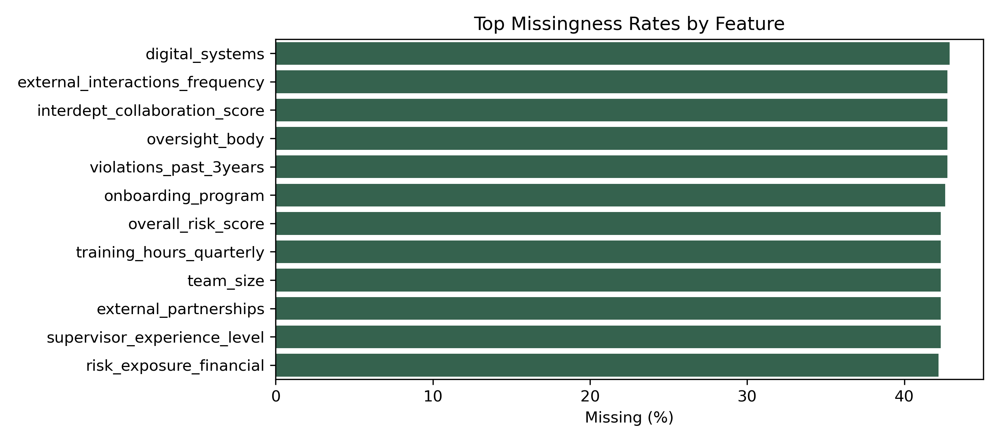
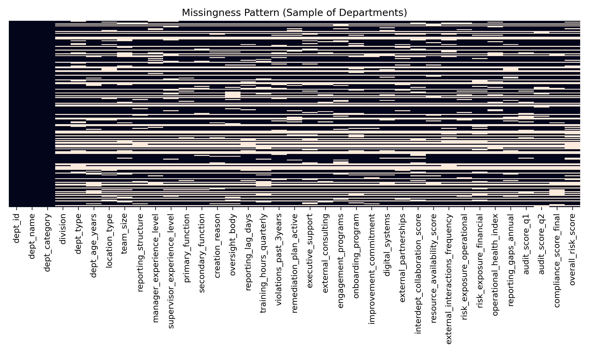
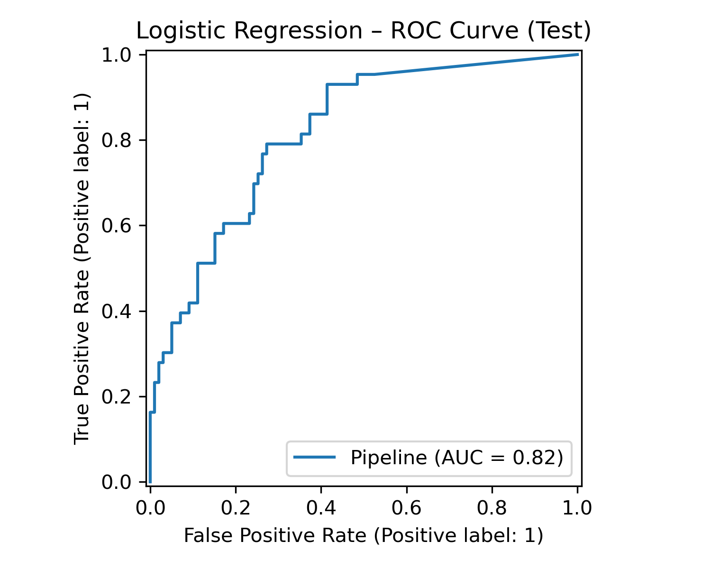
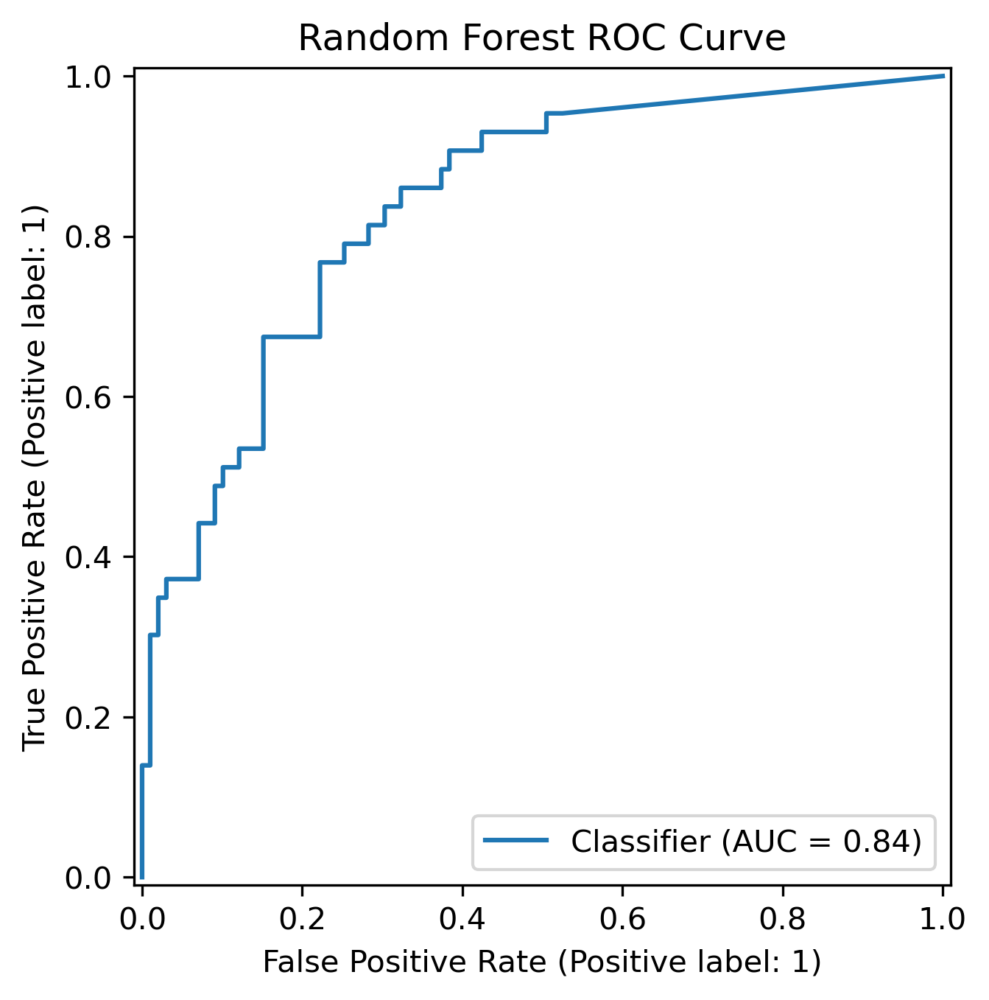
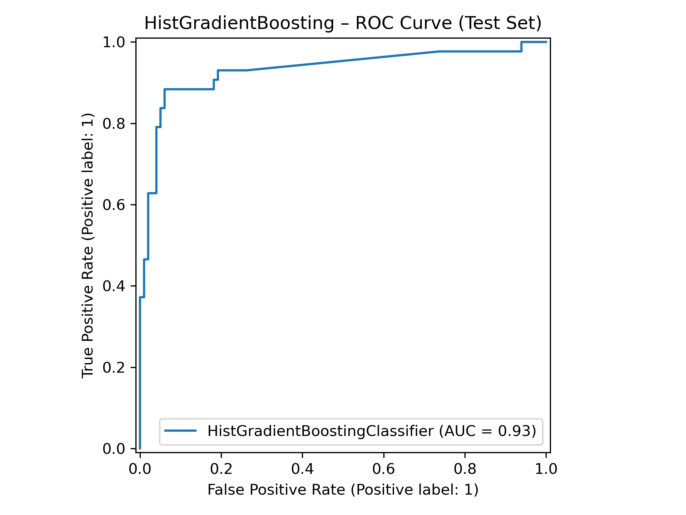
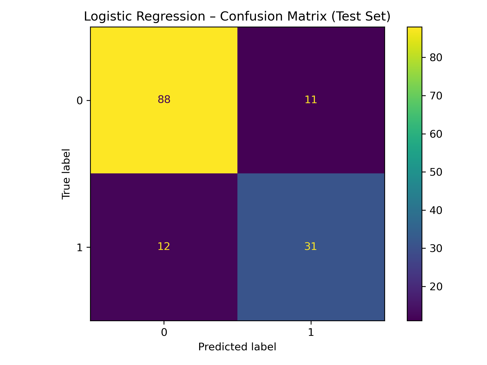
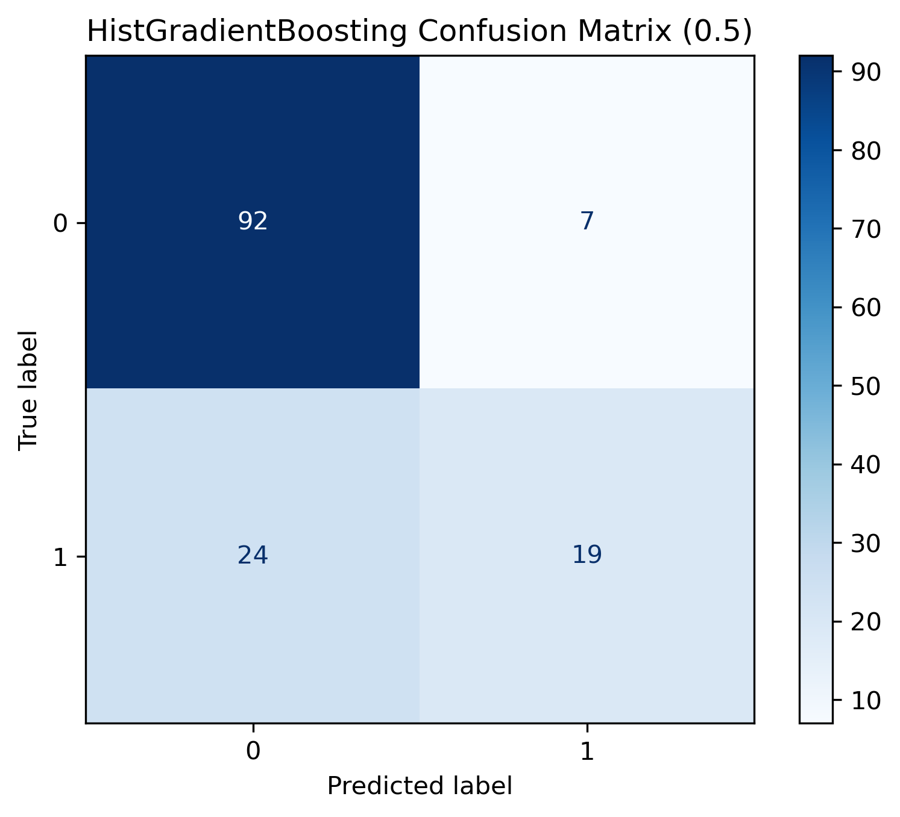
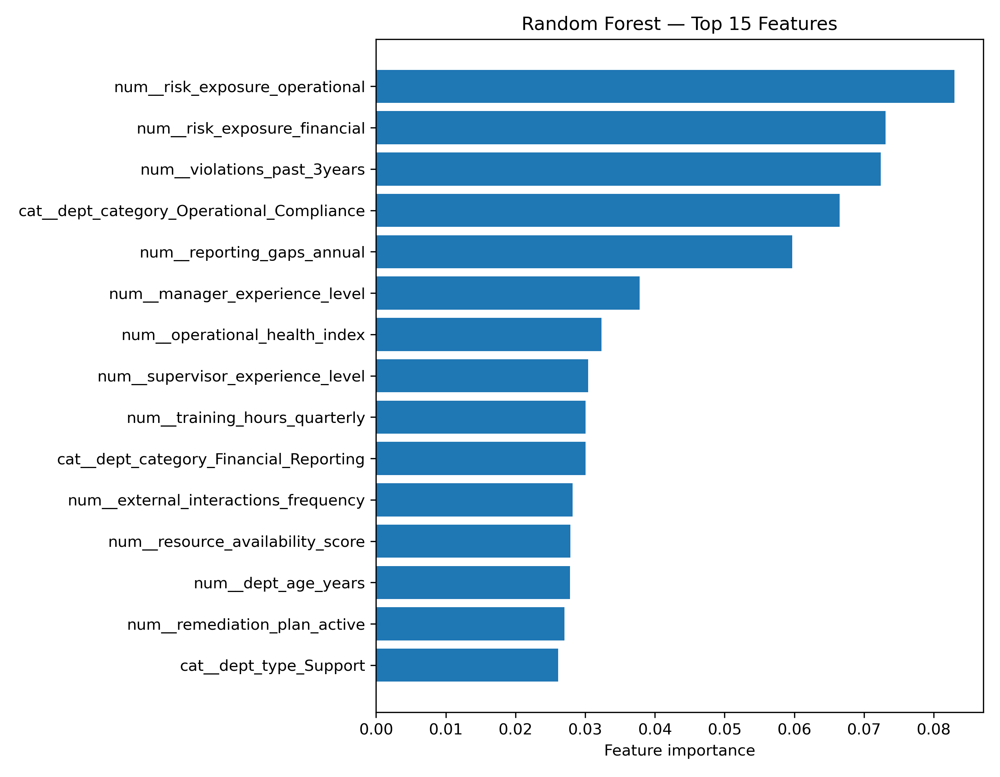
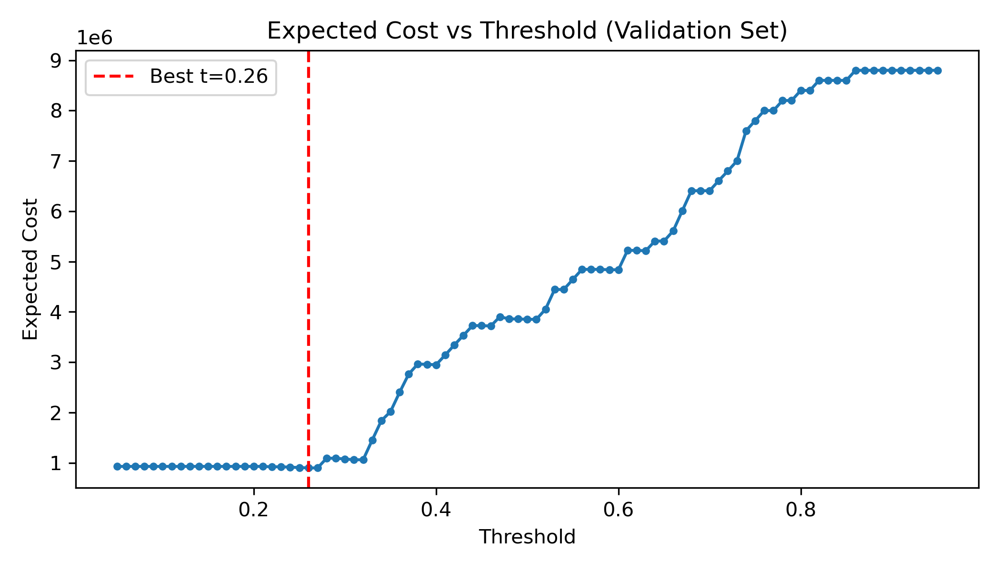
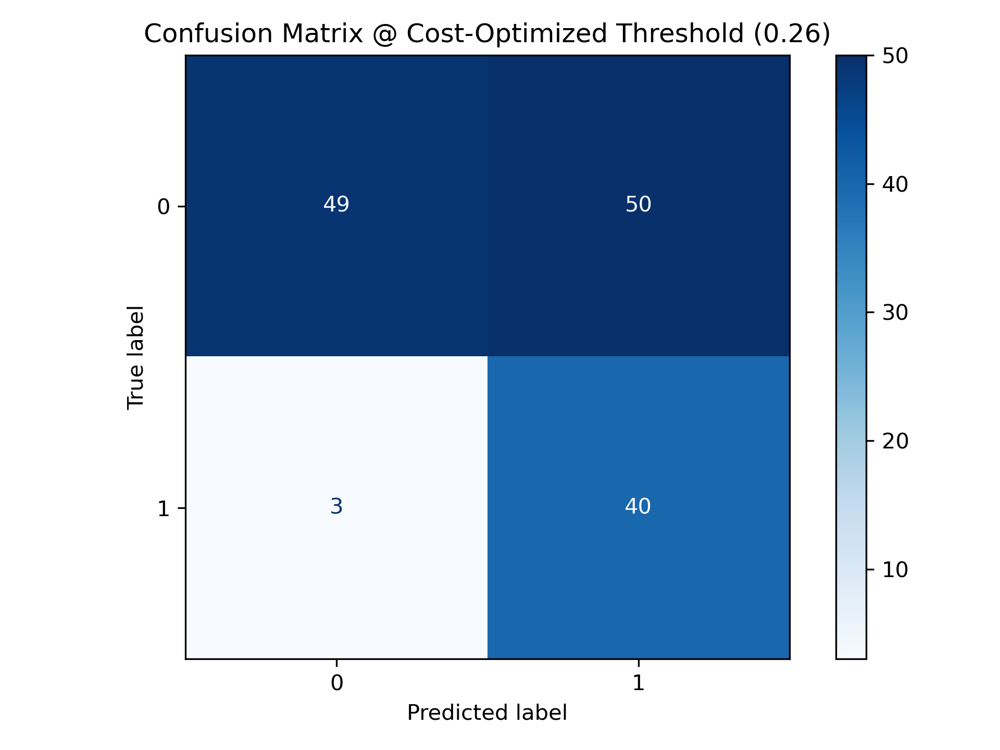

# Compliance Radar 321551

**Course:** Machine Learning  
**Author:** Deniz Mehmet Taylan  

---

## 1. Introduction

Modern organizations face increasing compliance risks arising from operational complexity, reporting practices, and organizational governance. Traditional compliance monitoring often relies on retrospective audit outcomes, which limits the ability to proactively identify departments that may pose elevated risk.

This project introduces **Compliance Radar**, a data-driven system designed to identify **high-risk departments** using **forward-looking operational and reporting signals** only, without relying on audit-derived or outcome-based variables. The objective is not to automate sanctions, but to support compliance oversight by prioritizing audits, allocating resources, and identifying areas where preventive action is most needed.

Using a structured organizational dataset stored in a SQLite database, we develop a **leakage-aware machine learning pipeline** that:

- strictly separates exploratory analysis from modeling,
- embeds all preprocessing steps within training-only pipelines,
- evaluates models using a robust train-validation-test strategy.

Several supervised models are evaluated, with a particular focus on model interpretability, fairness, and ethical deployment. The final system demonstrates that meaningful compliance risk signals can be extracted from operational behavior alone, offering a proactive complement to traditional compliance processes.


## 2. Methods

This section describes the methodological design of the Compliance Radar system, including data sources, feature construction, preprocessing strategy, model selection, training procedure, and implementation environment. The goal is to clearly explain the reasoning behind each design choice and ensure full reproducibility.

---

### 2.1 Data Source and Scope

The dataset used in this project is stored in a structured SQLite database (`data/org_compliance_data.db`).  
Multiple tables are available, including reference and aggregated information; however, the **departments** table is selected as the primary analytical dataset.

This choice is motivated by the fact that the departments table contains department-level operational, reporting, organizational, and risk-related variables that are suitable for predictive modeling. Additional tables (e.g., `high_risk_departments`, `data_dictionary`) are used only to construct the target variable and interpret feature meanings, respectively.

Importantly, **audit-derived outcome variables and aggregate risk scores are excluded from the feature set** to prevent information leakage and ensure forward-looking predictions.

---

### 2.2 Feature Design and Selection Strategy

Features are designed to capture **behavioral and structural signals** that may indicate elevated compliance risk. These include:

- operational health indicators,
- reporting delays and gaps,
- historical violation counts,
- exposure to operational and financial risk,
- governance and remediation-related variables.

Feature selection follows a **data-driven and leakage-aware approach**:

- Identifier fields (e.g., `dept_id`, `dept_name`) are removed.
- Audit scores and outcome-based risk measures are excluded.
- Exploratory feature analysis is conducted without reference to the target variable.
- Final feature inclusion is validated through model-based importance analysis rather than prior assumptions.

This strategy ensures that model predictions rely on anticipatory signals rather than retrospective enforcement outcomes.

---

### 2.3 Preprocessing and Leakage Prevention

To avoid data leakage, all preprocessing steps are embedded within a **scikit-learn pipeline** and applied only after data splitting.

The preprocessing pipeline consists of:

- **Numerical features**  
  - Median imputation  
  - Missingness indicators  
  - Standard scaling  

- **Categorical features**  
  - Mode imputation  
  - Missingness indicators  
  - One-hot encoding  

Crucially:
- No scaling, encoding, or imputation is applied before the train-validation-test split.
- All transformations are fitted **only on training data** and then applied to validation and test sets.

A separate dataset copy is used exclusively for exploratory data analysis (EDA), ensuring that visualization-oriented preprocessing does not affect model training.

---

### 2.4 Target Construction and Training Strategy

The target variable (`is_high_risk`) is constructed using the `high_risk_departments` reference table:

- 1 indicates a high-risk department,
- 0 indicates a non-high-risk department.

The modeling workflow follows a **two-stage split strategy**:

1. Train + validation vs. test split (80% / 20%)
2. Train vs. validation split within the training portion (75% / 25%)

This results in:
- 60% training data,
- 20% validation data,
- 20% test data.

All splits are stratified to preserve class balance.

In addition to the random split, a **temporal proxy split** is used to reduce temporal leakage:
- Departments are sorted by `dept_age_years` (older first).
- The newest departments are held out as a pseudo-future test set.

This is a proxy for real time-based validation and should be replaced by actual timestamps when available.

---

### 2.5 Model Selection and Training Overview

Three supervised classification models are evaluated:

- Logistic Regression (baseline linear model),
- Random Forest (ensemble tree-based model),
- Histogram-based Gradient Boosting (boosted ensemble model).

Baseline models are first evaluated using default hyperparameters.  
Subsequently, **GridSearchCV** is applied to each model using compact, interpretable hyperparameter grids.

Key design choices include:
- F1-score as the primary optimization metric, reflecting class imbalance and compliance priorities.
- Cross-validation performed only on training and validation data.
- The test set remains untouched until final evaluation.

---

### 2.6 Model Evaluation and Interpretability

Final models are evaluated on the held-out test set using:

- Accuracy,
- Precision,
- Recall,
- F1-score,
- ROC-AUC,
- Confusion matrices and ROC curves.

Because compliance costs are asymmetric, the best model also undergoes **cost-sensitive threshold optimization** on the validation set.
The selected threshold is then evaluated on the test set.

To support interpretability, **feature importance analysis** is performed using the tuned Random Forest model. Feature importance is extracted in a pipeline-safe manner, allowing insights into the drivers of compliance risk without violating leakage constraints.

---

### 2.7 Implementation Environment and Reproducibility

All experiments are implemented in Python. The main libraries used include:

- `pandas` and `numpy` for data manipulation,
- `sqlite3` for database access,
- `scikit-learn` for preprocessing, modeling, and evaluation,
- `matplotlib` and `seaborn` for visualization.

The full computational environment can be recreated using the provided `requirements.txt` file:

```bash
pip install -r requirements.txt
```


## 3. Experimental Design

This section describes the experiments conducted to validate the effectiveness of the Compliance Radar system. Each experiment is designed to assess the predictive performance, robustness, and practical suitability of different modeling approaches under a leakage-aware framework.

---

### 3.1 Experiment 1: Baseline Classification Performance

**Purpose**  
The goal of this experiment is to establish baseline performance levels for different model families when classifying departments as high risk or not high risk.

**Baselines**  
A **Logistic Regression** model with default hyperparameters is used as the primary baseline. This model represents a linear decision boundary and provides a reference point for understanding whether more complex models add value.

**Evaluation Metrics**  
- **F1-score**: chosen as the primary metric due to class imbalance and the need to balance precision and recall.  
- **Accuracy**: reported for completeness but not used for model selection.  
- **Precision and Recall**: used to understand false positive and false negative trade-offs.

---

### 3.2 Experiment 2: Comparison of Model Families

**Purpose**  
This experiment evaluates whether nonlinear and ensemble-based models outperform linear approaches in capturing compliance risk patterns.

**Baselines**  
The Logistic Regression baseline is compared against:
- **Random Forest**
- **Histogram-based Gradient Boosting**

All models are trained using the same preprocessing pipeline and data splits to ensure a fair comparison.

**Evaluation Metrics**  
- **F1-score**: primary comparison metric.  
- **ROC-AUC**: used to assess ranking and discrimination capability independent of a fixed threshold.  
- **Confusion Matrix**: used to analyze error types and misclassification behavior.

---

### 3.3 Experiment 3: Hyperparameter Optimization

**Purpose**  
The objective of this experiment is to determine whether carefully tuned hyperparameters improve model performance compared to default settings.

**Baselines**  
Each model's default configuration serves as its baseline and is compared against a tuned version obtained via **GridSearchCV**.

**Evaluation Metrics**  
- **Cross-validated F1-score**: used as the optimization objective during hyperparameter search.  
- **Test-set F1-score and ROC-AUC**: used to verify that improvements generalize to unseen data.

---

### 3.4 Experiment 4: Final Model Evaluation on Held-Out Test Set

**Purpose**  
This experiment assesses the generalization performance of the final selected models on a completely unseen test set.

**Baselines**  
All tuned models are evaluated under identical conditions. The comparison focuses on identifying the model that offers the best balance between recall and precision in a compliance context.

**Evaluation Metrics**  
- **F1-score**: primary metric for final model selection.  
- **Precision and Recall**: used to evaluate compliance-relevant trade-offs.  
- **ROC-AUC**: used to assess overall discriminative power.  
- **Confusion Matrix and ROC Curve**: used for interpretability and diagnostic analysis.

---

### 3.5 Interpretability and Risk Driver Analysis

**Purpose**  
The final experiment focuses on understanding which features drive compliance risk predictions.

**Baselines**  
Feature importance is extracted from the **Random Forest** model, selected for its strong performance and inherent interpretability.

**Evaluation Metrics**  
- **Relative feature importance scores**: used to rank predictors and identify key risk drivers.

This experiment validates that the model relies on forward-looking operational and reporting signals rather than audit-derived or outcome-based variables.

---

### 3.6 Cost-Sensitive Threshold Optimization

**Purpose**  
To reflect compliance cost asymmetry, we optimize the classification threshold based on expected costs rather than using the default 0.5 cutoff.

**Method**  
- False negatives are assigned a much higher cost than false positives.  
- The optimal threshold is selected on the validation set.  
- The chosen threshold is applied to the test set.

We approximate expected cost by computing realized cost on the validation set for each threshold.
---

### 3.7 Temporal Validation (Proxy)

**Purpose**  
To reduce temporal leakage, we evaluate the best model on a pseudo-future holdout.

**Method**  
- Departments are ordered by `dept_age_years`.  
- The newest departments are held out for testing.  
- The model is trained on older departments and evaluated on newer ones.


## 4. Results

This section summarizes the main empirical findings of the Compliance Radar project. All reported results are obtained from the held-out test set and are generated directly by the code in the notebook, ensuring reproducibility and unbiased evaluation.

---

### 4.1 Missingness and Surveillance Bias Check

Before modeling, we examine missingness patterns and compare missing rates between high-risk and non-high-risk departments.
This provides evidence for or against **surveillance bias**, where higher-risk departments may receive more monitoring and thus have more complete data.

**Figure 1 - Missingness Rates by Feature**  
*(Generated by missingness analysis code)*  


**Figure 2 - Missingness Pattern (Sample)**  
*(Generated by missingness analysis code)*  


**Figure 3 - Missingness Rate by Risk Group**  
*(Generated by missingness analysis code)*  


---

### 4.2 Main Findings

The experimental results demonstrate that compliance risk can be effectively identified using forward-looking operational and reporting features alone, without relying on audit-derived outcome variables.

Across all evaluated models, the following conclusions emerge:

- **Nonlinear models outperform linear baselines.**  
  Tree-based models consistently achieve higher F1-scores and ROC-AUC values than Logistic Regression, indicating that compliance risk arises from complex feature interactions.

- **Random Forest provides the best overall performance trade-off.**  
  While Histogram Gradient Boosting achieves strong ranking performance, Random Forest delivers the most balanced combination of precision, recall, and F1-score, making it particularly suitable for compliance monitoring scenarios where missing high-risk departments is costly.

- **Model performance is robust under class imbalance.**  
  Despite moderate class imbalance, the selected models maintain stable recall and discriminative power, confirming the suitability of F1-score and ROC-AUC as evaluation metrics.

Overall, the results validate the central contribution of the project: a leakage-aware, interpretable machine learning pipeline can successfully identify high-risk departments using operational signals only.

---

### 4.3 Model Performance Comparison

Table 1 summarizes the test-set performance of the evaluated models.  
This table is generated directly from the model comparison DataFrame produced in the notebook.

**Table 1 - Model Performance on Test Set**


<table border="1" class="dataframe">
  <thead>
    <tr style="text-align: right;">
      <th></th>
      <th>model</th>
      <th>accuracy</th>
      <th>precision</th>
      <th>recall</th>
      <th>f1</th>
      <th>roc_auc</th>
    </tr>
  </thead>
  <tbody>
    <tr>
      <th>1</th>
      <td>Random Forest</td>
      <td>0.795775</td>
      <td>0.733333</td>
      <td>0.511628</td>
      <td>0.602740</td>
      <td>0.843317</td>
    </tr>
    <tr>
      <th>0</th>
      <td>Logistic Regression</td>
      <td>0.711268</td>
      <td>0.519231</td>
      <td>0.627907</td>
      <td>0.568421</td>
      <td>0.804322</td>
    </tr>
    <tr>
      <th>2</th>
      <td>HistGradientBoosting</td>
      <td>0.774648</td>
      <td>0.720000</td>
      <td>0.418605</td>
      <td>0.529412</td>
      <td>0.839558</td>
    </tr>
  </tbody>
</table>
*Note: All values are computed on the held-out test set.*

---

### 4.4 ROC Curves and Confusion Matrices

Figure 4 presents the ROC curves for the evaluated models, illustrating their ability to discriminate between high-risk and non-high-risk departments across different thresholds.

Figure 5 shows the corresponding confusion matrices, providing insight into the types of classification errors made by each model.

- ROC curves confirm strong separability for tree-based models.
- Confusion matrices indicate that false negatives are kept relatively low, which is critical in compliance risk detection.

**Figure 4 - ROC Curves (Test Set)**  
*(Generated by model evaluation code)*





**Figure 5 - Confusion Matrices (Test Set)**

*(Generated by model evaluation code)*





---

### 4.5 Feature Importance Results

Figure 6 reports the feature importance scores extracted from the tuned Random Forest model.

The analysis highlights that:
- historical violations,
- reporting gaps and delays,
- exposure to operational and financial risk,
- governance-related indicators (e.g., training and remediation)

are among the most influential drivers of compliance risk predictions.

Importantly, audit-derived scores and outcome variables are not included, confirming that the model relies on forward-looking behavioral signals.

**Figure 6 - Random Forest Feature Importance**  
*(Generated by feature importance analysis code)*




---

### 4.6 Cost-Sensitive Threshold Outcomes

The validation-based cost optimization typically selects a threshold lower than 0.5, increasing recall and reducing costly false negatives.
The resulting confusion matrix and expected-cost comparison are produced in the notebook to document the decision rule under asymmetric costs.

**Figure 7 - Expected Cost vs Threshold (Validation Set)**  
*(Generated by threshold optimization code in the notebook)*  


**Figure 8 - Confusion Matrix at Cost-Optimized Threshold**  
*(Generated by threshold optimization code in the notebook)*  


---

### 4.7 Temporal Validation (Proxy) Findings

Temporal holdout performance is reported in the notebook to illustrate how the model behaves on newer departments.
This provides a more realistic estimate than a purely random split when time-related features are present.

---

### 4.8 Conclusion from Results

The empirical results confirm that the Compliance Radar system successfully meets its objective: identifying high-risk departments in a leakage-free, interpretable, and practically meaningful manner. The findings support the use of ensemble tree-based models, particularly Random Forest, as a strong foundation for compliance-oriented risk assessment tools.


## 5. Conclusions

This project demonstrates that compliance risk can be effectively identified using forward-looking operational, reporting, and governance-related signals through a leakage-aware machine learning framework. By strictly separating exploratory analysis from modeling, embedding all preprocessing within training-only pipelines, and evaluating models on a held-out test set, the Compliance Radar provides realistic and reproducible performance estimates. The results show that nonlinear, ensemble-based models--particularly Random Forest--are well suited for compliance monitoring, offering a strong balance between precision and recall while remaining interpretable through feature importance analysis. Overall, the project confirms that predictive analytics can serve as a valuable decision-support tool for compliance oversight without relying on audit-derived outcome variables.

Despite these promising results, several questions remain open and motivate future work. First, the analysis is based on a static snapshot of organizational data; evaluating model performance over time would be necessary to assess stability and robustness under real-world deployment. Second, while feature importance provides global interpretability, more granular, instance-level explanations could further improve transparency and trust. Finally, integrating additional contextual data sources and unsupervised learning techniques may uncover complementary risk patterns not captured by supervised models alone. Addressing these directions would strengthen the Compliance Radar and support its evolution into a scalable, operational compliance monitoring system.
